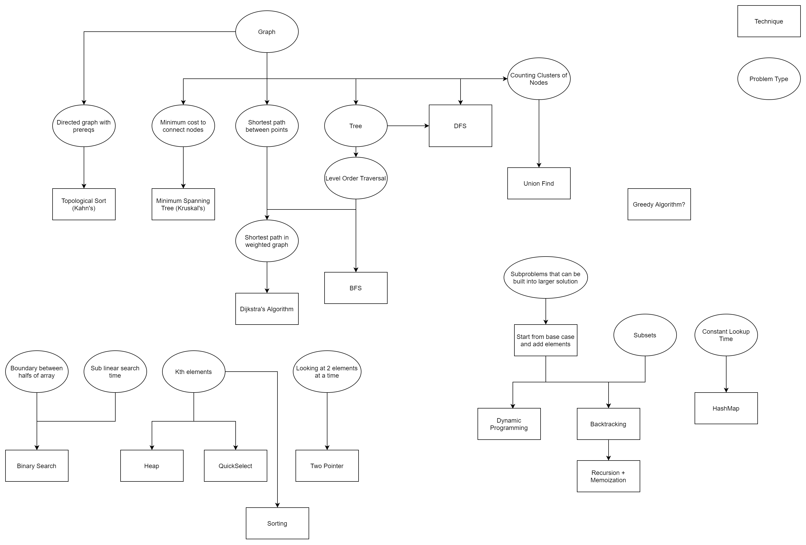

# CheatSheets

## Graph

- **Directed graph with prerequisites**
  - Topological Sort (Kahn’s)
- **Minimum cost to connect nodes**
  - Minimum Spanning Tree (Kruskal’s)
- **Shortest path between points**
  - Shortest path in weighted graph
    - Dijkstra’s Algorithm
- **Tree**
  - Level Order Traversal
    - BFS
- **Counting Clusters of Nodes**
  - DFS
  - Union Find

## Greedy Algorithm?

_(Note: Unconnected in the diagram but implied usage in several graph problems)_

## Subproblems that can be built into larger solution

- **Start from base case and add elements**
  - Dynamic Programming
  - Backtracking
    - Recursion + Memoization

## Subsets

- _(Related to Backtracking and DP problems)_

## Constant Lookup Time

- HashMap

## Searching and Selection

- **Boundary between halves of array**
  - Binary Search
- **Sub linear search time**
  - Kth elements
    - Heap
    - QuickSelect
- **Looking at 2 elements at a time**
  - Two Pointer
    - Sorting

## Technique | Problem Type

_(Present in the diagram but not connected directly to any nodes — could be headings for further categorization.)_
