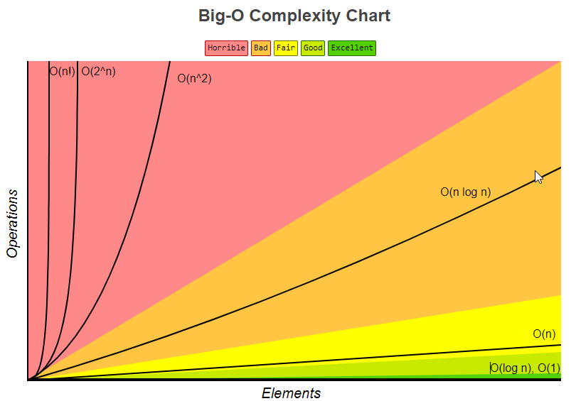

# Big O Notation

**Big O notation** is a mathematical way to describe the **time or space complexity** of an algorithm as a function of input size `n`.

It provides an **upper bound** on the growth rate of an algorithm—helping us understand performance as inputs scale. Think of it like a triathlon: if you're bad at one event, your overall time is limited by that event, no matter how good you are at the others.

## Time Complexity

- Describes how the **runtime** of an algorithm grows in the **worst-case scenario**
- Helps compare algorithms as input size increases

## Space Complexity

- Describes how **memory usage** grows
- Focuses on the **additional memory** needed as input grows
- Also considers temporary memory during algorithm execution
- Stack space in recursive calls count too

## Simplification Rules

As `n` becomes large:

- Drop lower-order/non-dominant terms
- Drop constant multipliers

> Example:  
> $$O\left(\frac{n^2}{2} + 3n\right) = O\left(\frac{n^2}{2}\right) = O(n^2)$$

We might still have a sum in a runtime if we don't have special knowledge about the terms and cannot reduce them

> Example:  
> $$O(B^2 + A)$$

## Common Time Complexities

|   Complexity | Name         | Description / Example                      |
| -----------: | ------------ | ------------------------------------------ |
|       `O(1)` | Constant     | Array access by index                      |
|   `O(log n)` | Logarithmic  | Binary search                              |
|       `O(n)` | Linear       | Loop through array once                    |
| `O(n log n)` | Linearithmic | Merge sort, quicksort (avg)                |
|      `O(n²)` | Quadratic    | Nested loops (e.g. bubble sort)            |
|      `O(n³)` | Cubic        | Triple nested loops, matrix multiplication |
|      `O(2ⁿ)` | Exponential  | Recursive Fibonacci                        |
|      `O(n!)` | Factorial    | Permutations, traveling salesman           |

> Any mathematical expression containing `n` can be wrapped in Big O:
>
> - `O(n + c) = O(n)`
> - `O(cn) = O(n)` where `c > 0`

## Notes

- Algorithms with better **Big O** may still be slower on small inputs
- Focus on the **dominant term**
- Constants don’t matter in Big O (since `∞ * c = ∞`)

## Best, Worst, and Average Case

Big O notation typically describes the **worst-case** complexity, but understanding all three cases is crucial:

| Case        | Description                           | Example (Quick Sort)                              |
| ----------- | ------------------------------------- | ------------------------------------------------- |
| **Best**    | Optimal input scenario                | O(n) – all elements are equal                     |
| **Average** | Expected performance over many inputs | O(n log n)                                        |
| **Worst**   | Pathological input                    | O(n²) – always chose the biggest element as pivot |

> 🧠 Be prepared to discuss all three cases for common algorithms.

## Amortized Time Complexity

Some operations are costly occasionally but cheap on average:

- **Example**: Appending to a dynamic array
  - Usually `O(1)`
  - Occasionally `O(n)` during resize
  - **Amortized** time per operation is still `O(1)`

> 📌 **Amortized ≠ Average case**: It refers to the cost spread over a series of operations, not different inputs.

## Common Data Structure Operations Complexity

| Data Structure         | Time Complexity (Average)                                                                                    |                                                                                                              |                                                                                                              |                                                                                                              | Time Complexity (Worst)                                                                                      |                                                                                                              |                                                                                                              |                                                                                                              | Space Complexity                                                                                               |
| ---------------------- | ------------------------------------------------------------------------------------------------------------ | ------------------------------------------------------------------------------------------------------------ | ------------------------------------------------------------------------------------------------------------ | ------------------------------------------------------------------------------------------------------------ | ------------------------------------------------------------------------------------------------------------ | ------------------------------------------------------------------------------------------------------------ | ------------------------------------------------------------------------------------------------------------ | ------------------------------------------------------------------------------------------------------------ | -------------------------------------------------------------------------------------------------------------- |
|                        | Access                                                                                                       | Search                                                                                                       | Insertion                                                                                                    | Deletion                                                                                                     | Access                                                                                                       | Search                                                                                                       | Insertion                                                                                                    | Deletion                                                                                                     | Worst                                                                                                          |
| **Array**              | O(1)     | O(n)     | O(n)     | O(n)     | O(1)     | O(n)     | O(n)     | O(n)     | O(n)       |
| **Stack**              | O(n)     | O(n)     | O(1)     | O(1)     | O(n)     | O(n)     | O(1)     | O(1)     | O(n)       |
| **Queue**              | O(n)     | O(n)     | O(1)     | O(1)     | O(n)     | O(n)     | O(1)     | O(1)     | O(n)       |
| **Singly-Linked List** | O(n)     | O(n)     | O(1)     | O(1)     | O(n)     | O(n)     | O(1)     | O(1)     | O(n)       |
| **Doubly-Linked List** | O(n)     | O(n)     | O(1)     | O(1)     | O(n)     | O(n)     | O(1)     | O(1)     | O(n)       |
| **Skip List**          | O(log n) | O(log n) | O(log n) | O(log n) | O(n)     | O(n)     | O(n)     | O(n)     | O(n log n) |
| **Hash Table**         | N/A                                                                                                          | O(1)     | O(1)     | O(1)     | N/A                                                                                                          | O(n)     | O(n)     | O(n)     | O(n)       |
| **Binary Search Tree** | O(log n) | O(log n) | O(log n) | O(log n) | O(n)     | O(n)     | O(n)     | O(n)     | O(n)       |
| **Cartesian Tree**     | N/A                                                                                                          | O(log n) | O(log n) | O(log n) | N/A                                                                                                          | O(n)     | O(n)     | O(n)     | O(n)       |
| **B-Tree**             | O(log n) | O(log n) | O(log n) | O(log n) | O(log n) | O(log n) | O(log n) | O(log n) | O(n)       |
| **Red-Black Tree**     | O(log n) | O(log n) | O(log n) | O(log n) | O(log n) | O(log n) | O(log n) | O(log n) | O(n)       |
| **Splay Tree**         | N/A                                                                                                          | O(log n) | O(log n) | O(log n) | O(log n) | O(log n) | O(log n) | O(log n) | O(n)       |
| **AVL Tree**           | O(log n) | O(log n) | O(log n) | O(log n) | O(log n) | O(log n) | O(log n) | O(log n) | O(n)       |
| **KD Tree**            | O(log n) | O(log n) | O(log n) | O(log n) | O(n)     | O(n)     | O(n)     | O(n)     | O(n)       |

> `*` Insert/Delete assumes access to head/tail or known position.
> Balanced BSTs like **AVL** or **Red-Black Trees** maintain `O(log n)` in all operations.

## Array Sorting Algorithms Complexity

| Algorithm          | Time Complexity                                                                                                |                                                                                                                   |                                                                                                                   | Space Complexity                                                                                             |
| ------------------ | -------------------------------------------------------------------------------------------------------------- | ----------------------------------------------------------------------------------------------------------------- | ----------------------------------------------------------------------------------------------------------------- | ------------------------------------------------------------------------------------------------------------ |
|                    | Best                                                                                                           | Average                                                                                                           | Worst                                                                                                             | Worst                                                                                                        |
| **Quicksort**      | Ω(n log n) | Θ(n log n)    | O(n²)         | O(log n) |
| **Mergesort**      | Θ(n log n) | Θ(n log n)    | Θ(n log n)    | O(n)     |
| **Timsort**        | Ω(n)       | Θ(n log n)    | O(n log n)    | O(n)     |
| **Heapsort**       | Ω(n log n) | Θ(n log n)    | O(n log n)    | O(1)     |
| **Bubble Sort**    | Ω(n)       | Θ(n²)         | O(n²)         | O(1)     |
| **Insertion Sort** | Ω(n)       | Θ(n²)         | O(n²)         | O(1)     |
| **Selection Sort** | Ω(n²)      | Θ(n²)         | O(n²)         | O(1)     |
| **Tree Sort**      | Ω(n log n) | Θ(n log n)    | O(n²)         | O(n)     |
| **Shell Sort**     | Ω(n log n) | Θ(n (log n)²) | O(n (log n)²) | O(1)     |
| **Bucket Sort**    | Ω(n + k)   | Θ(n + k)      | O(n²)         | O(n)     |
| **Radix Sort**     | Ω(nk)      | Θ(nk)         | O(nk)         | O(n + k) |
| **Counting Sort**  | Ω(n + k)   | Θ(n + k)      | O(n + k)      | O(k)     |
| **Cubesort**       | Θ(n log n) | Θ(n log n)    | Θ(n log n)    | O(n)     |

## Big O Complexity Chart

## Add vs Multiply

- If your algorithm is in the form of "do this, then, when you're all done, do that", you **add** runtimes.
- If your algorithm is in the form of "do this for each time you do that", you **multiply** runtimes.

## Common Pitfalls in Interviews

- Confusing **log(n)** with **n log n**
- Underestimating how quickly **quadratic time (O(n²))** grows
- Forgetting constant-time operations in **nested loops**
- Misidentifying recursion complexity — always analyze:
  - Using a **recurrence relation**
  - Or a **recursion tree method**

## Big O, Big Θ (Theta), and Big Ω (Omega)

| Notation | Meaning     | Analogy / Bound  |
| -------- | ----------- | ---------------- |
| `O`      | Upper bound | ≤ — Worst-case   |
| `Ω`      | Lower bound | ≥ — Best-case    |
| `Θ`      | Tight bound | ≈ — Exact growth |

There is not relationship between best/worst/expected case and Big O/Ω/Θ notation. Best/worst/expected cases simply describe the Big O (or big theta) time for particular inputs or scenarios.

Big O, Big Θ , and Big Ω describer the upper, tight, and lower bounds for the runtime.

> 💬 **Industry vs Academia**:
>
> - In **academia**, `O(n²)` is technically valid for a linear algorithm—it’s just a loose upper bound.
> - In **industry** and interviews, we typically express the **tightest** possible bound, e.g., say `O(n)` not `O(n²)` for a linear loop.

### Example

For printing elements of an array:

- **O(n)** – Worst-case upper bound
- **Ω(n)** – Best-case lower bound
- **Θ(n)** – Tight bound (it’s always `n`)
