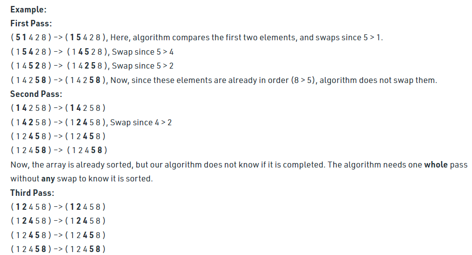

# Bubble Sort

**Bubble Sort** is a simple comparison-based sorting algorithm where adjacent elements are compared and swapped if they are in the wrong order.  
In each pass, the largest unsorted element "bubbles up" to its correct position at the end of the list.

## How It Works

1. Start at the beginning of the array.
2. Compare the first two elements.
3. Swap them if the first is greater than the second.
4. Move to the next pair and repeat.
5. Continue looping through the array until no swaps are needed.

**Visualization**:  


## Time and Space Complexity

| Case    | Time Complexity                         |
| ------- | --------------------------------------- |
| Best    | O(n) (when optimized with a swap check) |
| Average | O(n²)                                   |
| Worst   | O(n²)                                   |

| Space Complexity | O(1) (in-place) |
| ---------------- | --------------- |

## Java Example

```java showLineNumbers
class BubbleSort {

    static void bubbleSort(int array[]) {
        int size = array.length;
        boolean swapped;

        for (int i = 0; i < size - 1; i++) {
            swapped = false;

            for (int j = 0; j < size - i - 1; j++) {
                // Compare adjacent elements
                if (array[j] > array[j + 1]) {
                    // Swap if out of order
                    int temp = array[j];
                    array[j] = array[j + 1];
                    array[j + 1] = temp;
                    swapped = true;
                }
            }

            // Optimization: If no swaps, the array is sorted
            if (!swapped) break;
        }
    }

    public static void main(String args[]) {
        int arr[] = {64, 34, 25, 12, 22, 11, 90};
        bubbleSort(arr);
        System.out.println("Sorted array:");
        for (int num : arr) {
            System.out.print(num + " ");
        }
    }

}
```

## Interview Tips

- Be ready to explain why **Bubble Sort** is rarely used in practice (inefficient for large datasets).
- Mention its **simplicity** and **educational value** — useful for teaching sorting concepts.
- Know how to implement the **optimization** that stops early if no swaps occur during a pass (best case O(n)).
- Be aware that although Bubble Sort is a **stable sort** and works **in-place**, better algorithms exist for real-world sorting.

## Summary

**Bubble Sort** is a simple, easy-to-understand sorting algorithm where the largest unsorted elements "bubble up" to the end of the array through repeated comparisons and swaps.  
While inefficient for large datasets, it serves as a great introduction to sorting concepts and algorithmic thinking.
