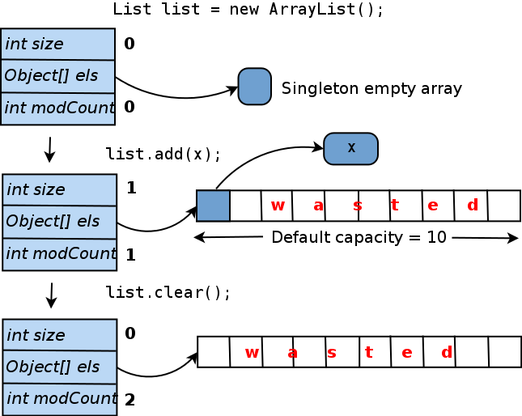

## ArrayList

An **ArrayList** is a **resizable array** implementation in Java, part of the `java.util` package. It allows dynamic resizing, easy element access by index, and provides many utility methods.

## Key Features

- **Dynamic sizing** — no need to know the size in advance.
- **Indexed access** — fast random access like arrays.
- **Built-in methods** — add, remove, search, sort, etc.
- **Backed by an array** — resizing happens automatically behind the scenes.
- Maintains the order of insertion.
- Allows duplicates.
- Not synchronized (not thread-safe by default).

## Capacity Management

- Internally, `ArrayList` maintains a backing array.
- When more space is needed, it grows the array (usually by 50% of current size).
- **However, when you remove elements, the internal array is _not downsized automatically_** — only the `size` is reduced, not the capacity.
- If you want to reduce the memory footprint, use `trimToSize()` to manually shrink the backing array to match the current size.



## Use Cases

- You need **fast read access by index** (e.g. `.get(i)`).
- You frequently **add or remove at the end** of the list.
- You want a **flexible collection** that grows as needed.

## Time Complexity

| Operation              | Time Complexity | Notes                                |
| ---------------------- | --------------- | ------------------------------------ |
| Access (get/set)       | O(1)            | Constant time due to direct indexing |
| Add at end (amortized) | O(1)            | Occasionally O(n) due to resizing    |
| Add/remove at index    | O(n)            | Elements must be shifted             |
| Search (by value)      | O(n)            | Linear scan                          |
| Resize (internal)      | O(n)            | Happens automatically as needed      |

## Example: Basic Operations

```java showLineNumbers
import java.util.ArrayList;

public class Main {
public static void main(String[] args) {
ArrayList<String> list = new ArrayList<>();

        list.add("apple");
        list.add("banana");
        list.add("cherry");

        System.out.println(list.get(1)); // banana

        list.remove("banana");
        list.add(1, "blueberry");

        for (String fruit : list) {
            System.out.println(fruit);
        }
    }

}
```

## Example: Integers and Size

```java showLineNumbers
import java.util.ArrayList;

public class Numbers {
public static void main(String[] args) {
ArrayList<Integer> nums = new ArrayList<>();

        for (int i = 0; i < 5; i++) {
            nums.add(i * 10);
        }

        System.out.println("Size: " + nums.size());      // 5
        System.out.println("Contains 20? " + nums.contains(20)); // true
    }

}
```

## ArrayList vs Array

| Feature       | Array                     | ArrayList                                     |
| ------------- | ------------------------- | --------------------------------------------- |
| Size          | Fixed at creation         | Grows automatically                           |
| Syntax        | `int[] arr = new int[5]`  | `ArrayList<Integer> list = new ArrayList<>()` |
| Generic types | Only object types allowed | Supports generics                             |
| Flexibility   | Less flexible             | Very flexible                                 |
| Performance   | Slightly faster access    | Slight overhead from methods                  |

## ArrayList vs LinkedList

| Feature                 | ArrayList | LinkedList                 |
| ----------------------- | --------- | -------------------------- |
| Access                  | O(1)      | O(n)                       |
| Insert/delete at end    | O(1)      | O(1)                       |
| Insert/delete in middle | O(n)      | O(1) (with pointer)        |
| Memory usage            | Less      | More (extra node pointers) |

Use `ArrayList` when you need **fast index-based access** and infrequent inserts/removals from the middle.

## When to Use

- You need fast random access and occasional insertions/deletions.
- You want a flexible-size alternative to arrays.
- You mostly add/remove elements at the end of the list.

## When Not to Use

- You frequently insert or remove elements at the beginning or middle — consider `LinkedList` instead.
- You need thread safety — consider `CopyOnWriteArrayList` or synchronize externally.

## Tips for Interviews

- If asked for a dynamic array — use `ArrayList`.
- Avoid `ArrayList<Integer>` for performance-critical problems — prefer `int[]` when possible.
- Use `.add()`, `.remove()`, `.get()`, `.set()` for fast prototyping.

## Alternatives

- `LinkedList`: better for frequent insertions/removals in middle
- `Vector`: thread-safe version of `ArrayList` (rarely needed now)
- `CopyOnWriteArrayList`: safe in concurrent environments (read-heavy)

> ✅ Use ArrayList when you want dynamic arrays with fast read and flexible API.
