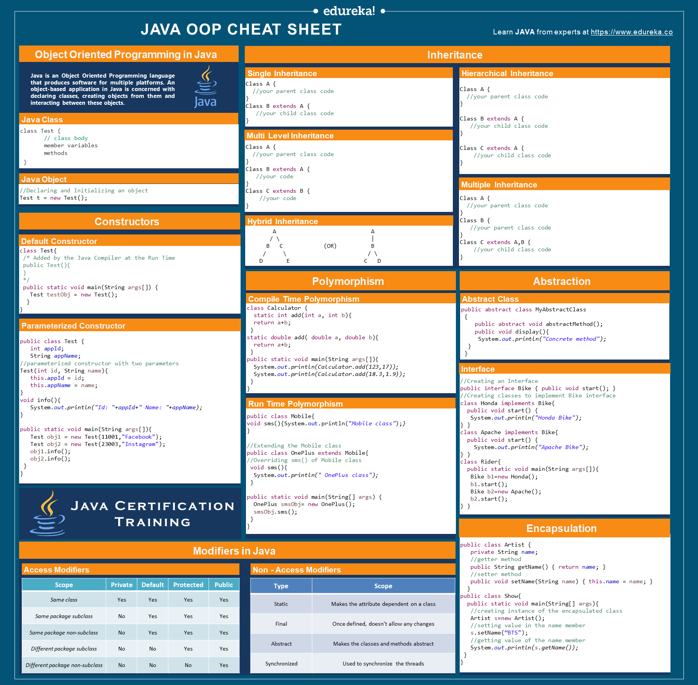

# Java Cheat Sheets

## Language Fundamentals

- **Primitive Types**: byte, short, int, long, float, double, char, boolean
- **Wrapper Classes**: Byte, Short, Integer, Long, Float, Double, Character, Boolean
- **Operators**: Arithmetic (+ - \* / %), Relational (== != > < >= <=), Logical (&& || !), Bitwise (& | ^ ~ << >>)
- **Type Casting**: Widening (automatic), Narrowing (explicit)

## Common Pitfalls

- Use `equals()` for **string** comparison, not `==`
- Always use **safe `mid` calculation** in binary search → `mid = lo + (hi - lo) / 2`
- Understand **null pointer** risks in objects and collections

## Core OOP Principles

| Concept          | Key Points                                  |
| ---------------- | ------------------------------------------- |
| Encapsulation    | Hide data, use getters/setters              |
| Inheritance      | `extends` keyword                           |
| Polymorphism     | Method overloading & overriding             |
| Abstraction      | Abstract classes & interfaces               |
| Access Modifiers | `private`, `default`, `protected`, `public` |

**Tip**: Prefer coding to _interfaces_, not implementations.

## Collections

| Interface | Common Implementations |
| --------- | ---------------------- |
| List      | ArrayList, LinkedList  |
| Set       | HashSet, TreeSet       |
| Map       | HashMap, TreeMap       |

- `List`: Ordered, allows duplicates
- `Set`: No duplicates
- `Map`: Key-value pairs

**Big O you MUST know**:

- ArrayList add → O(1), get → O(1)
- LinkedList add/remove → O(1), get → O(n)
- HashMap get/put → O(1) average

## Strings

| Method        | Purpose                       |
| ------------- | ----------------------------- |
| equals()      | Value comparison              |
| ==            | Reference comparison          |
| substring()   | Substring                     |
| charAt()      | Get character                 |
| toCharArray() | String to char[]              |
| indexOf()     | First occurrence              |
| trim()        | Remove surrounding whitespace |

**Immutability**: Strings are immutable.  
**Use**: For mutability → `StringBuilder` or `StringBuffer` (thread-safe).

## Algorithms (Must Know)

| Concept                         | TC             | SC       |
| ------------------------------- | -------------- | -------- |
| Binary Search                   | O(log n)       | O(1)     |
| Linear Search                   | O(n)           | O(1)     |
| Bubble/Selection/Insertion Sort | O(n²)          | O(1)     |
| Merge Sort                      | O(n log n)     | O(n)     |
| Quick Sort                      | O(n log n) avg | O(log n) |

**Tip**: Always remember to explain **base case and recurrence** in recursion.

## Data Structures (Essentials)

- **Array** → Fixed size, O(1) access
- **LinkedList** → O(1) insert/delete at head
- **Stack** → LIFO, use `Deque` or `Stack`
- **Queue** → FIFO, use `LinkedList` or `ArrayDeque`
- **Heap/PriorityQueue** → Fast min/max access
- **HashMap** → Key-value, constant-time access
- **Trie** → Efficient prefix searching

**Trees & Graphs**:

- Understand **DFS** vs **BFS** tradeoffs
- Know **Tree traversals** (Inorder, Preorder, Postorder, Level Order)

## Dynamic Programming (Interview Level)

- Always identify **subproblems** and **overlapping substructure**
- Remember: **Memoization** → Top-down, **Tabulation** → Bottom-up

**Classic DP Problems**:

- Fibonacci sequence
- Knapsack
- Longest Common Subsequence / Substring

## Concurrency (High Level)

- **Thread**: `Thread`, `Runnable`, `Callable`
- **Synchronization**: `synchronized` keyword
- **Thread-safe Collections**: `ConcurrentHashMap`, `CopyOnWriteArrayList`

**Tip**: Be ready to explain **race conditions** and basic **thread safety** concepts.

## Quick Coding Reminders

- Always clarify input/output formats
- Start with brute force, then optimize
- Communicate trade-offs
- Use meaningful variable names
- Check edge cases: empty arrays, nulls, single element, sorted/unsorted data
- Think about **time and space complexity** of every solution

## Useful Online Patterns & Practice

- [Leetcode Patterns](https://seanprashad.com/leetcode-patterns/)
- [Grokking the Coding Interview](https://designgurus.io/)
- [Big O Cheat Sheet](https://www.bigocheatsheet.com/)
- [Visual Algo](https://visualgo.net/en)

**Pro Tip:**  
In interviews, it's not about writing the most optimal solution immediately. It's about **explaining your thought process clearly**, **iteratively improving your approach**, and **communicating trade-offs**.

