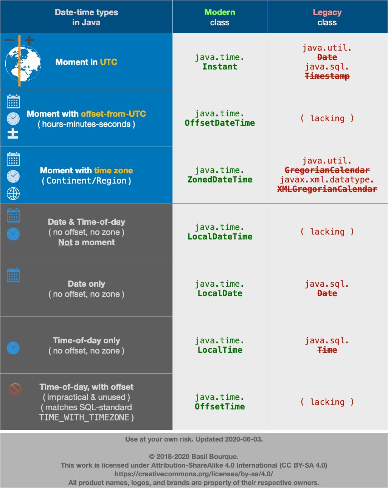

# Java Date and Time API

Modern Java date and time handling is powered by the **java.time** package (Java 8+), replacing the problematic older `Date`, `Calendar`, and `SimpleDateFormat` classes.

## Key Concepts

| Type               | Purpose                             |
| ------------------ | ----------------------------------- |
| **Instant**        | Represents a specific moment in UTC |
| **LocalDate**      | Date only (no time, no zone)        |
| **LocalTime**      | Time only (no date, no zone)        |
| **LocalDateTime**  | Date + Time (no zone)               |
| **OffsetDateTime** | Date + Time + fixed UTC offset      |
| **ZonedDateTime**  | Date + Time + full time zone        |
| **ZoneOffset**     | Fixed offset from UTC               |
| **ZoneId**         | Full time zone including rules      |

**Important:**

- `Instant` = exact point in time (UTC).
- `LocalDateTime` = date and time, but **ambiguous** (no time zone or offset).
- `ZonedDateTime` = date and time with zone → precise moment.

## Common Usage Examples

```java
// Instant - exact moment
Instant now = Instant.now();

// LocalDateTime - date + time (no zone)
LocalDateTime ldt = LocalDateTime.now();

// ZonedDateTime - date + time + zone
ZoneId zone = ZoneId.of("Europe/Paris");
ZonedDateTime zdt = ZonedDateTime.now(zone);

// OffsetDateTime
OffsetDateTime odt = OffsetDateTime.now();

// Convert LocalDateTime to ZonedDateTime
ZonedDateTime zdt2 = ldt.atZone(zone);

// Convert ZonedDateTime to Instant
Instant instant = zdt2.toInstant();
```

## Why does LocalDateTime _NOT_ represent a moment?

`LocalDateTime` lacks time zone or offset information. Example:

- `2025-05-06T15:00` → Could mean different moments in New York vs. Paris vs. Tokyo.

Use `ZonedDateTime` or `Instant` when the actual moment matters.

## DateTimeFormatter

```java
DateTimeFormatter formatter = DateTimeFormatter.ofPattern("yyyy-MM-dd HH:mm");
String formatted = ldt.format(formatter);
```

## When to Use Each

| Use Case                   | Type                               |
| -------------------------- | ---------------------------------- |
| Precise timestamp          | `Instant`                          |
| Displaying date/time in UI | `LocalDateTime` or `ZonedDateTime` |
| Comparing times globally   | `Instant` or `ZonedDateTime`       |
| Dates only                 | `LocalDate`                        |
| Times only                 | `LocalTime`                        |

## JDBC Tip

Most JDBC drivers (Java 8+) now support `java.time` types directly. Use `OffsetDateTime` or `LocalDateTime` in your SQL queries or ORM tools (Hibernate, JPA).

## Pro Interview Insight

- **Always store** datetimes in **UTC** (`Instant`) in databases and backends.
- **Only convert** to `ZonedDateTime` or `LocalDateTime` when presenting to users.
- Understand the **difference between offset and zone**:
  - `OffsetDateTime` → static offset (`+02:00`)
  - `ZonedDateTime` → full timezone rules (`Europe/Paris` which includes DST changes).

## Cheat Images (Recommended)

- Java Date/Time hierarchy diagram → 

## Java.time for Business Apps

For most business apps:

```java
Instant for storing → ZonedDateTime for displaying
```

Avoid `LocalDateTime` unless:

- You need date/time **without** knowing the specific time zone (ex: recurring events like "every Monday at 10:00").

## Legacy Interop (Quick Tip)

```java
Date legacyDate = new Date();
Instant instant = legacyDate.toInstant();
```

## Android Note

Use `java.time` for API 26+.  
For earlier Android → use **ThreeTenABP**.

## Advanced

If you need:

- **Week-based dates** → `YearWeek` (ThreeTen-Extra)
- **Quarters** → `YearQuarter` (ThreeTen-Extra)
- **Intervals** → `Interval` (ThreeTen-Extra)

---

**Remember:** Always prefer the _java.time_ package over legacy `Date`/`Calendar` classes.
