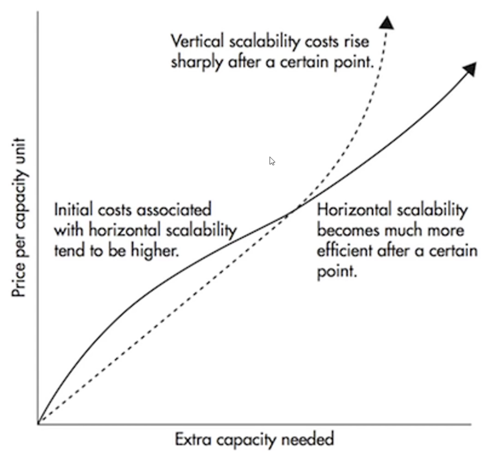

# Scaling

## What is Scaling?

**Scaling** refers to the process of increasing the capacity of a system to handle a growing amount of work or its ability to accommodate growth. In modern system design, scaling is critical to maintaining performance, reliability, and availability as user demand increases.

## Types of Scaling

### Vertical Scaling (Scaling Up)

- **Definition**: Adding more resources (CPU, RAM, storage) to a single server.
- **Pros**:

  - Simple to implement.
  - No changes to application logic.

- **Cons**:

  - Hardware limits.
  - Higher costs at higher levels.
  - Single point of failure.

- **Best For**: Small to medium workloads, monolithic applications.

### Horizontal Scaling (Scaling Out)

- **Definition**: Adding more servers to distribute the workload.
- **Pros**:

  - Practically unlimited scalability.
  - Improves fault tolerance.
  - Lower latency by deploying servers closer to users.

- **Cons**:

  - More complex infrastructure.
  - Requires load balancing.
  - Potential data consistency challenges.

- **Best For**: Distributed systems, microservices, large-scale web apps.

## Diminishing Returns

- Adding more resources leads to less incremental performance gain.
- Often caused by bottlenecks, software limitations, or architectural constraints.
- Seen in both vertical and horizontal scaling strategies.

## Latency and Geographical Scaling

- Horizontal scaling enables **geographical distribution** of servers.
- Reduces latency by serving users from nearby data centers.
- Enhances **user experience** and **global availability**.

## Trade-offs

| Consideration           | Horizontal Scaling                                    | Vertical Scaling              |
| ----------------------- | ----------------------------------------------------- | ----------------------------- |
| **Cost Efficiency**     | Better at scale                                       | Expensive at high levels      |
| **Complexity**          | More complex (requires orchestration, load balancing) | Simple to implement           |
| **Fault Tolerance**     | High (failover across nodes)                          | Low (single point of failure) |
| **Latency**             | Can be optimized geographically                       | Limited by central server     |
| **Diminishing Returns** | Lower impact due to distributed load                  | High at hardware limits       |

**Illustration**:

## Server Components in Scaling

**Key components impacted by scaling**:

- **Web Server**: Handles HTTP requests.
- **Application Server**: Executes application logic.
- **Database**: Stores and retrieves data.
- **Cache**: Reduces load on backend systems.
- **Load Balancer**: Distributes traffic across servers.

## Key Takeaways

- Start simple; scale only when needed.
- Horizontal scaling offers better long-term flexibility.
- Vertical scaling may suit early-stage or smaller systems.
- Always consider the trade-offs between cost, complexity, and performance.
