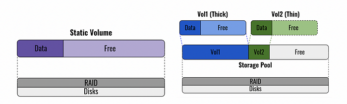
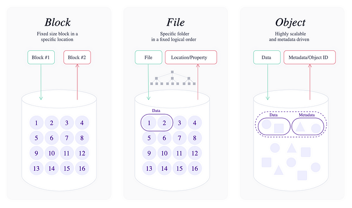

# Storage

## 1. Disk — RAID and Volume

### 1.1 RAID

**RAID (Redundant Array of Independent Disks)** combines multiple physical drives into logical units to improve redundancy, performance, or both.

| Features                 | RAID 0                                                                         | RAID 1                                   | RAID 5                                   | RAID 6                                                                                              | RAID 10                                           |
| ------------------------ | ------------------------------------------------------------------------------ | ---------------------------------------- | ---------------------------------------- | --------------------------------------------------------------------------------------------------- | ------------------------------------------------- |
| Minimum number of drives | 2                                                                              | 2                                        | 3                                        | 4                                                                                                   | 4                                                 |
| Fault tolerance          | None                                                                           | Single-drive failure                     | Single-drive failure                     | Two-drive failure                                                                                   | Up to one disk failure in each sub-array          |
| Read performance         | High                                                                           | Medium                                   | Low                                      | Low                                                                                                 | High                                              |
| Write performance        | High                                                                           | Medium                                   | Low                                      | Low                                                                                                 | Medium                                            |
| Capacity utilization     | 100%                                                                           | 50%                                      | 67% – 94%                                | 50% – 88%                                                                                           | 50%                                               |
| Typical applications     | High end workstations, data logging, real-time rendering, very transitory data | Operating systems, transaction databases | Data warehousing, web serving, archiving | Data archive, backup to disk, high availability solutions, servers with large capacity requirements | Fast databases, file servers, application servers |

### 1.2 Volume

**Volume**: A logical storage unit.

- **Static Volume**: Uses all available space, no storage pool.
- **Thin Volume**: Allocates space as data is written.
- **Thick Volume**: Pre-allocates entire space at creation.

## 2. File Storage, Block Storage, and Object Storage

| Storage Type | Description                                  | Use Cases                                         |
| ------------ | -------------------------------------------- | ------------------------------------------------- |
| File         | Hierarchical directories, NFS/SMB protocols  | Shared drives, NAS, file servers                  |
| Block        | Data divided into uniformly sized blocks     | Databases, virtual machine storage, SAN           |
| Object       | Data stored as objects with metadata and IDs | Cloud storage, backups, unstructured data storage |

**Key Insight**:

- **File**: Simple, user-friendly.
- **Block**: Fast, flexible, but expensive.
- **Object**: Scalable, cost-effective, suited for massive datasets.

## 3. Hadoop Distributed File System (HDFS)

- Designed for **large, distributed data**.
- Stores files as **blocks** replicated across commodity hardware.
- Optimized for **streaming data access**, not frequent modifications.
- Often paired with MapReduce or Spark for large-scale data processing.

## 4. Storage Comparisons

| Comparison      | SAN                  | NAS      | HDFS                         |
| --------------- | -------------------- | -------- | ---------------------------- |
| Storage Type    | Block                | File     | Block                        |
| Access Protocol | Fibre Channel, iSCSI | NFS, SMB | Hadoop-specific API          |
| Performance     | High                 | Moderate | High (for distributed tasks) |
| Scalability     | Moderate             | Moderate | High                         |

**Block Storage vs. Object Storage**:  
Object storage offers lower cost and better scalability but lacks the low-latency access and flexibility of block storage.

## 5. Choosing the Right Datastore

| Application                     | Metadata DB            | Content Storage         |
| ------------------------------- | ---------------------- | ----------------------- |
| Photo-sharing (e.g., Instagram) | SQL/NoSQL              | Object Storage (S3)     |
| URL Shortener                   | NoSQL                  | Key-Value Store         |
| File hosting (Dropbox)          | SQL/NoSQL              | Block/Object Storage    |
| Instant Messaging               | Wide-column DB (HBase) | -                       |
| Video sharing (YouTube)         | SQL/NoSQL              | Distributed File System |
| Real-time suggestions           | In-memory (Redis)      | -                       |
| Web Crawler                     | SQL/NAS                | -                       |
| Analytics                       | Cassandra/Spark        | Object/Block Storage    |

## 6. Storage Options in the Cloud

| Storage Type | AWS                       | Azure               | Google Cloud          |
| ------------ | ------------------------- | ------------------- | --------------------- |
| File         | Elastic File System (EFS) | Azure Files         | Filestore             |
| Block        | Elastic Block Store (EBS) | Azure Managed Disks | Persistent Disks      |
| Object       | S3                        | Azure Blob Storage  | Cloud Storage Buckets |

## Key Takeaways

- **RAID** improves redundancy and performance at the disk level.
- **File Storage**: Familiar and easy to manage, but limited scalability.
- **Block Storage**: Best for high-performance needs.
- **Object Storage**: Highly scalable and cost-effective for unstructured data.
- **HDFS**: Suited for large, distributed data sets in analytics.
- **Cloud Storage**: Offers flexible, scalable solutions across storage types.
- **Always choose storage based on workload characteristics and cost-performance balance.**

## References

- [RAID](https://www.dataplugs.com/en/raid-level-comparison-raid-0-raid-1-raid-5-raid-6-raid-10/)
- [Different types of storage](https://blog.scaleway.com/2020/understanding-the-different-types-of-storage/)
- [File block and object storage](https://www.redhat.com/en/topics/data-storage/file-block-object-storage)
- [ubuntu — file, block and object storage](https://ubuntu.com/blog/what-are-the-different-types-of-storage-block-object-and-file)
- [S3 vs HDFS](https://databricks.com/blog/2017/05/31/top-5-reasons-for-choosing-s3-over-hdfs.html)
- [HDFS](https://hadoop.apache.org/docs/r1.2.1/hdfs_design.html)
- [File Storage](https://www.ibm.com/cloud/learn/file-storage)
- [Oracle blog-what is object storage](https://blogs.oracle.com/bigdata/what-is-object-storage)
- [What is cloud object storage](https://aws.amazon.com/what-is-cloud-object-storage/?nc1=h_ls)
- [Understanding Object Storage and Block Storage Use Cases](https://cloudacademy.com/blog/object-storage-block-storage/)
- [Google cloud storage options](https://cloud.google.com/compute/docs/disks)

## Other Topics for System Design

- [System Design — Load Balancing](https://medium.com/must-know-computer-science/system-design-load-balancing-1c2e7675fc27)
- [System Design — Caching](https://medium.com/must-know-computer-science/system-design-caching-acbd1b02ca01)
- [System Design — Sharding / Data Partitioning](https://medium.com/must-know-computer-science/system-design-sharding-data-partitioning-b7201596aafa)
- [System Design — Indexes](https://medium.com/must-know-computer-science/system-design-indexes-f6ad3de9925d)
- [System Design — Proxies](https://medium.com/must-know-computer-science/system-design-proxies-ef5f2c2676f2)
- [System Design — Message Queues](https://medium.com/must-know-computer-science/system-design-message-queues-245612428a22)
- [System Design — Redundancy and Replication](https://medium.com/must-know-computer-science/system-design-redundancy-and-replication-e9946aa335ba)
- [System Design — SQL vs. NoSQL](https://medium.com/must-know-computer-science/system-design-sql-vs-nosql-4cdfb9f53d69)
- [System Design — CAP Problem](https://medium.com/must-know-computer-science/system-design-cap-problem-13997ed7524c)
- [System Design — Consistent Hashing](https://medium.com/must-know-computer-science/system-design-consistent-hashing-f66fa9b75f3f)
- [System Design — Client-Server Communication](https://medium.com/must-know-computer-science/system-design-client-server-communication-674818ca448d)
- [System Design — Storage](https://medium.com/must-know-computer-science/system-desing-storage-d8ef4a8d952c)
- [System Design — Other Topics](https://medium.com/must-know-computer-science/system-design-other-topics-b93b22828608)
- [Object-Oriented Programming — Basic Design Patterns in C++](https://medium.com/must-know-computer-science/basic-design-patterns-in-c-39bd3d477a5c)
